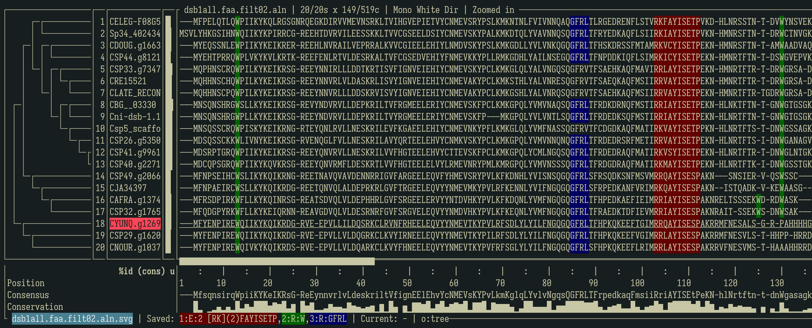

# MSAfara

## (forked and modified from sib-swiss/termal)

After years of using vim as an MSA viewer, and despondent of waiting for Jalview to start up, I knew someone would have made a terminal interface for this purpose, and I found `termal` to be the best. I've made some modifications in msafara for saving your work in sessions, arbitrary subsets of sequence as views, highlighting motifs, generating and viewing MAFFT alignment trees, exporting to SVG, and reordering and filtering individual sequences. The project name in this repo is now `msafara`, meaning caravan in Swahili. 

See `wishlist.md` for proposed enhancements and future features.

## Terminal colors and themes

msafara relies on standard ANSI colors. If your terminal theme remaps ANSI black to a non-black color, dark backgrounds may appear tinted. For best results, use a theme where ANSI black is pure black and the default background is also black. If colors look off, try a different theme or adjust your terminal palette. I have only tested this on WezTerm (OSX).
